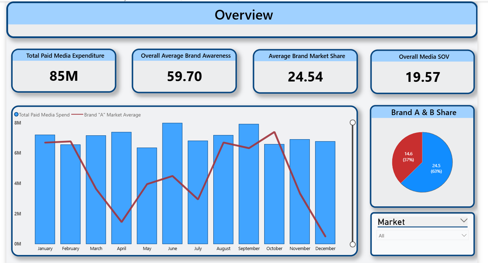
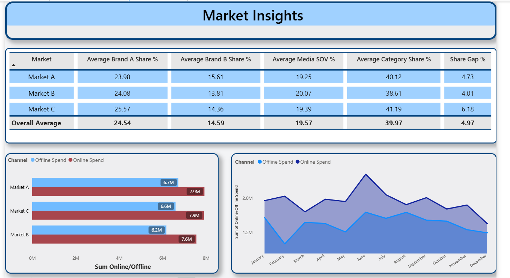

# Marketing & Media Performance Analytics Dashboard  
**Power BI Case Study | By Hardik Singh**

---

## Overview
This project is an end-to-end analytics case study focused on evaluating marketing performance across multiple markets for a cosmetics company.  

The objective is to analyze how **media investments translate into brand outcomes** such as market share, awareness, and consumer preference.

The case study was provided by Pivot&Co based on a real client scenario. Due to confidentiality constraints, the dataset used is partially synthetic but preserves realistic business patterns.

---

## Business Problem
Marketing teams invest heavily in paid media, but key questions remain:

- Does higher spend lead to higher market share?  
- Are we over- or under-investing compared to competitors?  
- Which markets are inefficient in media utilization?  
- How does media exposure impact consumer perception?  

This project answers these questions through a structured data model and KPI-driven dashboard.

---

## Data Model (Star Schema)

The model follows a **star schema design** to ensure scalability and performance.

### Fact Tables
- Market Spend (Paid media investments)
- Media Share (Market share & Share of Voice)
- Awareness (Consumer perception metrics)

### Dimension Tables
- Date_Dimension (custom calendar table)
- Market_Dimension
- Channel_Dimension (standardized media channels)

### Why This Design?
- Improves query performance in Power BI  
- Enables reusable DAX measures  
- Ensures consistent filtering across visuals  
- Eliminates redundancy and ambiguity  

---

## Data Preparation

- Cleaned column names (removed spaces/special characters)
- Created a unified **date calendar**
- Standardized channel categories
- Ensured consistent granularity across datasets

---

## Key KPIs (DAX Driven)

### 1. Total Paid Media Spend
**Definition:** Sum of all media investments  
**Purpose:** Baseline for performance comparison  

---

### 2. Brand Market Share
**Definition:** Brand A market share across regions  
**Purpose:** Core business outcome  

---

### 3. Share of Voice (SOV)
**Definition:** Media presence relative to competitors  
**Purpose:** Leading indicator of market share  

---

### 4. Share Gap %
**Formula:** Share Gap % = Market Share - Share of Voice
**Purpose:**
- Identifies over/under-investment
- Key decision-making metric for executives  

---

### 5. Awareness, Consideration, Preference
**Purpose:**
- Connects marketing spend to consumer perception
- Measures brand strength beyond sales  

---

## Dashboard Features

- Market-wise performance comparison  
- KPI trend analysis over time  
- Media efficiency tracking  
- Consumer funnel analysis  
- Interactive filters (market, channel, time)  

---

## Key Insights

### Media Spend vs Market Share
Higher investment does not always translate into higher market share, indicating inefficiencies in certain markets.

### Share of Voice Alignment
SOV closely follows spend patterns, confirming media visibility but also highlighting competitive intensity.

### Share Gap Analysis
Markets with negative share gaps indicate under-investment or inefficient allocation.

### Consumer Metrics Stability
Awareness and preference show slower variation, indicating long-term brand impact rather than immediate response to spend.

### Channel Strategy Differences
Different markets use varied channel mixes, influencing performance outcomes.

---

## Tools & Technologies

- Power BI  
- DAX (Data Analysis Expressions)  
- Data Modeling (Star Schema)  
- Excel (data preparation)  

---

## My Contributions

- Designed and implemented the star schema data model  
- Developed all KPI logic using DAX  
- Built interactive dashboard for business users  
- Performed data cleaning and transformation  
- Conducted analysis and extracted key business insights  

---

## Business Impact

This dashboard enables:

- Better budget allocation decisions  
- Identification of inefficient markets  
- Improved media strategy alignment  
- Data-driven marketing performance tracking

## Dashboard Preview

### Overview

### KPI Trends

### Market Analysis

---

## Data Disclaimer

The dataset used in this project is partially synthetic and created for analytical purposes.  
It is based on a real business case provided by Pivot&Co, but no confidential client data is disclosed.

---

## Future Improvements

- Integration with real-time media data  
- Advanced forecasting for market share  
- ROI optimization modeling  
- Channel-level attribution analysis  

---

## Author

**Hardik Singh**  
MSc Data Management & Artificial Intelligence  
